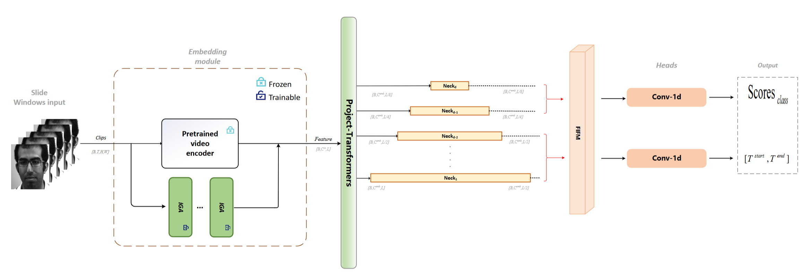
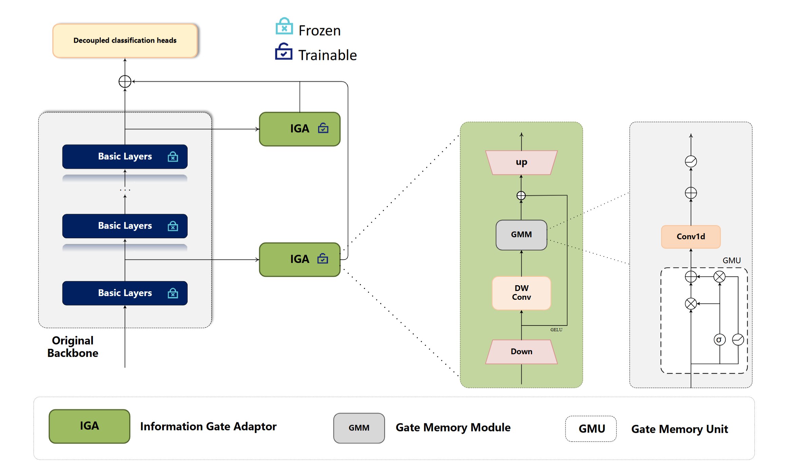
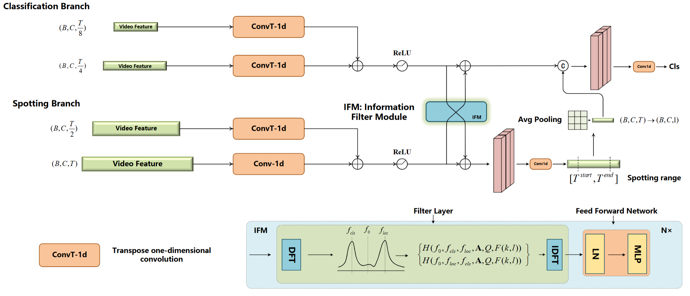

# FGSL: Frequency-Gated Spatiotemporal Learning for Micro-Expression Spotting-Recognition (ACM MM MEGC2025)


##   :jack_o_lantern: Abstract

Micro-Expression (ME) analysis under real-world conditions faces challenges from environmental variations, spontaneous facial movements, and dataset imbalances. While the Spot-then-Recognize (STR) paradigm integrates temporal spotting and emotion recognition, its performance is compromised by sensitivity to lighting/pose changes and subtle motion characteristics. To address these limitations, we propose an enhanced VideoMAE V2-based framework with three key innovations: (1) A Spatiotemporal Information Gating Adapter (IGA) that enhances dependency modeling while preventing overfitting; (2) Multi-scale task decoupling through image pyramids that separates localization and classification; (3) A novel Frequency-based Information Filtering Module (FIFM) for selective feature retention across scales. Our method is called FGSL, which significantly improves robustness on SAMM and CASME datasets by jointly optimizing spatiotemporal feature extraction and task-specific information flow.


## 🚀 Main Method
We propose a novel framework featuring two key innovations: the Frequency-Division Filtering (FIFM) module—the first task-aware feature decoupling mechanism operating in the frequency domain—and the Memory-Enhanced Adapter (IGA) with dynamic forgetting for temporal modeling. Comprehensive ablations systematically validate their synergistic effects: IGA achieves 200\% STRS improvement over frozen backbones, pyramid decoupling boosts F1-scores by 27\%, and FIFM emerges as the primary performance contributor. Ranked second in the MEGC 2025 STR Track, our solution delivers optimal spatiotemporal modeling efficiency with minimal parameters.The architecture is shown as follows:

<div align="center">
  <br>
  <em>Fig 1：Overview of our Method</em>
</div>


<div align="center">
  <br>
  <em>Fig 2：Our Adaptor</em>
</div>


<div align="center">
  <br>
  <em>Fig 3：FIFM</em>
</div>

## :crescent_moon: MEGC 2025 Track STR Leaderboard

<div align="center">
  <br>
  <em>Fig 4：Leaderboard</em>
</div>

## ⤴️ Training

```
python train.py
```
you might edit datasets.py, config.py, to suit your data

